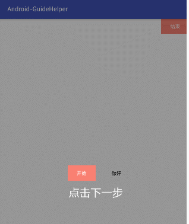
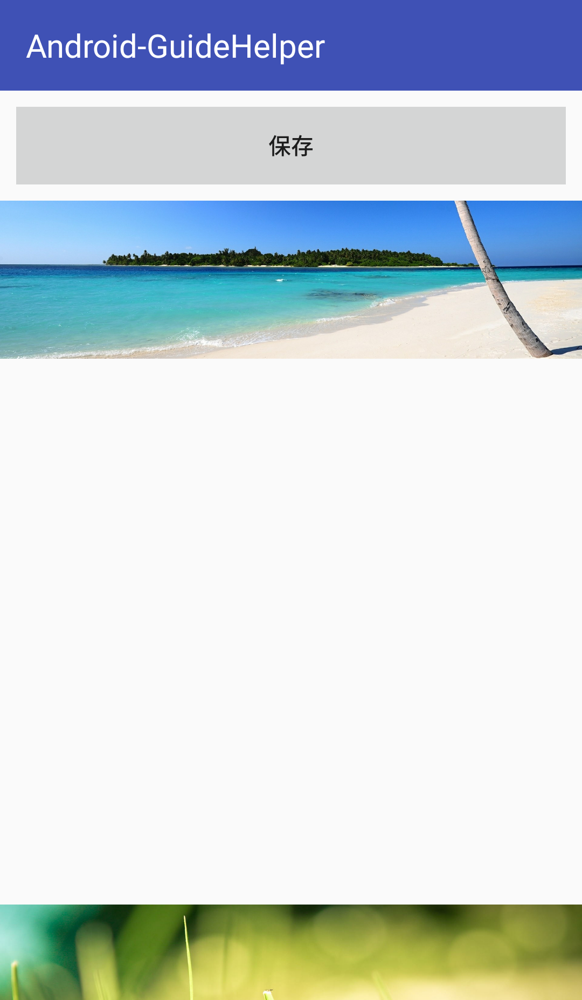

# Android-GuideHelper
Android蒙版向导开发的一些领悟，希望可以用其中的一些知识延伸出更多的东西。
#效果图



这次主要是使用了自定义Dialog的方式来实现这个效果
主要步骤：
1、创建一个自定义VIew的Dialog
2、复制一个需要高亮显示的View在同样的位置，并完美覆盖
3、绘制提示图片

思考：第一步和第三步都比较轻松，难点是第二步，如何复制一个View并完美覆盖 。

第一步：创建一个自定义VIew的Dialog

    guidelayout = new RelativeLayout(activity);

    //创建Dialog，遮挡状态栏
    guideDialog = new Dialog(activity, android.R.style.Theme_DeviceDefault_Light_DialogWhenLarge_NoActionBar);
    //设置背景颜色
    guideDialog.getWindow().setBackgroundDrawable(new ColorDrawable(0x66000000));
    //设置自定义的布局
    guideDialog.setContentView(guidelayout);
    //设置布局的属性
    guideDialog.getWindow().setLayout(WindowManager.LayoutParams.MATCH_PARENT, WindowManager.LayoutParams.MATCH_PARENT);
    //设置点击不能取消
    guideDialog.setCancelable(false);
    //显示Dialog
    guideDialog.show();

第二步：复制一个需要高亮显示的View在同样的位置，并完美覆盖

步骤如下：
1、获取原来的VIew的位置和宽高
2、获取自定义布局在视图的位置，View的Y轴坐标减去这个位置的Y轴坐标，避免Dialog不是全屏的时候位置偏移，就可以可以实现全局覆盖了
3、获取原来的VIew的视图缓存
4、根据视图缓存获取bitmap
5、创建一个ImageView，设置位置，把bitmap设置为背景

1、获取原来的View的位置和宽高
  ```
 //获取view的宽高
int vWidth = lightView.getMeasuredWidth();
int vHeight = lightView.getMeasuredHeight();
   
//如果宽高都小于等于0，再measure试下获取
if (vWidth <= 0 || vHeight <= 0) {
               ViewGroup.LayoutParams mlayoutParams = lightView.getLayoutParams();
               lightView.measure(mlayoutParams.width, mlayoutParams.height);
               vWidth = lightView.getMeasuredWidth();
               vHeight = lightView.getMeasuredHeight();
}
   
           //获取不到宽高则返回操作
           if (vWidth <= 0 || vHeight <= 0) {
               Log.e("GuideHelper", "宽高都小于等于0");
               return;
           }
```

2、获取自定义布局在视图的位置，View的Y轴坐标减去这个位置的Y轴坐标，避免Dialog不是全屏的时候位置偏移，就可以可以实现全局覆盖了
```
//获取view在屏幕的位置
int[] location = new int[2];
lightView.getLocationOnScreen(location);

//获取layout在屏幕上的位置
int layoutOffset[] = new int[2];
guidelayout.getLocationOnScreen(layoutOffset);

//这里避免dialog不是全屏，导致view的绘制位置不对应
location[1] -= layoutOffset[1];

3、根据视图缓存获取bitmap
//开启能缓存图片信息
lightView.setDrawingCacheEnabled(true);
//获取视图缓存
lightView.buildDrawingCache();

Bitmap LightBitmap = lightView.getDrawingCache();
if (LightBitmap != null) {
  //根据缓存获取Bitmap
  LightBitmap = Bitmap.createBitmap(LightBitmap);
} else {
  //如果获取不到，则用创建一个view宽高一样的bitmap用canvas把view绘制上去
  LightBitmap = Bitmap.createBitmap(vWidth, vHeight, Bitmap.Config.ARGB_8888);
  Canvas canvas = new Canvas(LightBitmap);
  lightView.draw(canvas);
}

//关闭能缓存图片信息
lightView.setDrawingCacheEnabled(false);
//释放缓存
lightView.destroyDrawingCache();
```
4、创建一个ImageView，设置位置，把bitmap设置为背景，添加到布局
```
//设置ImageView属性
ImageView newLightView = new ImageView(activity);
newLightView.setScaleType(ImageView.ScaleType.CENTER_INSIDE);
newLightView.setImageBitmap(LightBitmap);

//动态设置Viwe的id
int imageViewId = R.id.snack;
newLightView.setId(imageViewId);

//设置位置
RelativeLayout.LayoutParams params = new RelativeLayout.LayoutParams(ViewGroup.LayoutParams.WRAP_CONTENT, ViewGroup.LayoutParams.WRAP_CONTENT);
params.leftMargin = location[0];
params.topMargin = location[1];

//添加到布局
guidelayout.addView(newLightView, params);
```
到这里就完成对需要高亮的View的复制了，注意的是这个view最好设置背景颜色，不然有可能没有效果。


显示提示图片：就是获取资源的Bitmap，然后创建ImageView，设Bitmap为背景
```
/**********显示提示图片**********/
//获取提示图片的Bitmap
Bitmap tipBitmap = BitmapFactory.decodeResource(activity.getResources(), tipsImageResourceId);

//设置大小
RelativeLayout.LayoutParams layoutParams = new RelativeLayout.LayoutParams(ViewGroup.LayoutParams.WRAP_CONTENT, ViewGroup.LayoutParams.WRAP_CONTENT);
int showViewHeight = tipBitmap.getHeight();
int showViewWidth = tipBitmap.getWidth();

//设置ImageView属性
ImageView newTipView = new ImageView(activity);
newTipView.setScaleType(ImageView.ScaleType.CENTER_INSIDE);
layoutParams.width = showViewWidth;
layoutParams.height = showViewHeight;
newTipView.setImageBitmap(tipBitmap);

//设置间距(可自行封装)
//layoutParams.topMargin += dipToPix(activity, 20);

//设置相对位置(可自行封装)
layoutParams.addRule(RelativeLayout.BELOW, newLightView.getId());
layoutParams.addRule(RelativeLayout.ALIGN_LEFT, newLightView.getId());
//layoutParams.addRule(RelativeLayout.CENTER_HORIZONTAL);

//添加到布局
guidelayout.addView(newTipView, layoutParams);
```

还有一些属性和点击事件的设置可以自己封装

思考：为什么要使用getDrawingCache()获取缓存？
在这个例子当中最重要的是复制一个view，而复制一个View的重点又是根据getDrawingCache()获取缓存的Bitmap，并显示在界面上
getDrawingCache()被经常用来做屏幕截图，比如说：

看下手机截图：


截图之后的图片




可以看到，截取了除状态栏外，标题栏和内容的界面，关键代码如下：
```
  /**
      * 截取当前程序界面
      */
     private void saveView() {
         //DecorView只有一个子元素为LinearLayout。代表整个Window界面，包含通知栏，标题栏，内容显示栏三块区域
         View decorView = getWindow().getDecorView();
         //开启能缓存图片信息
         decorView.setDrawingCacheEnabled(true);
         //获取视图缓存
         decorView.buildDrawingCache();
         //根据缓存获取Bitmap
         Bitmap bmp = decorView.getDrawingCache();

         Rect rect = new Rect();
         //getWindowVisibleDisplayFrame方法可以获取到程序显示的区域，包括标题栏，但不包括状态栏
         decorView.getWindowVisibleDisplayFrame(rect);
         //获取状态栏高度
         int statusBarHeight = rect.top;

         //获取图片宽高
         int width = bmp.getWidth();
         int height = bmp.getHeight();

         //坐标轴和高度都减去状态栏的高度
         Bitmap saveBmp = Bitmap.createBitmap(bmp, 0, statusBarHeight,
                 width, height - statusBarHeight, null, false);

         //关闭能缓存图片信息
         decorView.setDrawingCacheEnabled(false);
         //释放缓存
         decorView.destroyDrawingCache();

         //将图片保存到SD卡
         saveBitmap("ScreenShot", saveBmp);
     }

```

有时候，我们需要截取超过屏幕外的界面，比如说listview和scrollView，就要动态计算加起来的子view的总高度了，效果图如下：


关键代码如下：

```
   /**
       * 截取超过程序界面的长图
       */
      private void saveLongView() {
          int h = 0;
          // 获取listView实际高度
  //        for (int i = 0; i < listView.getChildCount(); i++) {
  //            h += listView.getChildAt(i).getHeight();
  //        }
          // 获取scrollView实际高度
          for (int i = 0; i < scrollView.getChildCount(); i++) {
              h += scrollView.getChildAt(i).getHeight();
          }
          //如果是webView
  //        Picture snapShot = webView.capturePicture();
  //        Bitmap bmp = Bitmap.createBitmap(snapShot.getWidth(),
  //                snapShot.getHeight(), Bitmap.Config.ARGB_8888);
  //        Canvas canvas = new Canvas(bmp);
  //        snapShot.draw(canvas);
          Log.i("ScreenShot", " 高度:" + scrollView.getHeight());
          Log.i("ScreenShot", "实际高度:" + h);

          Bitmap bitmap;
          // 创建对应大小的bitmap
          bitmap = Bitmap.createBitmap(scrollView.getWidth(), h,
                  Bitmap.Config.ARGB_8888);
          final Canvas canvas = new Canvas(bitmap);
          scrollView.draw(canvas);

          //将图片保存到SD卡
          saveBitmap("ScreenShot", bitmap);
      }
```

未完待续，继续拓展延伸：


GridView拖动交换位置效果